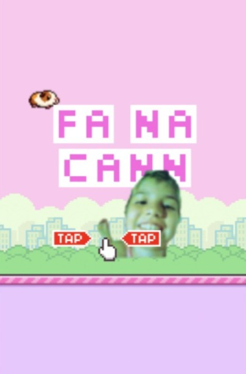

# MrpBird - Flappy Guinea Pig Edition

Un divertente clone di Flappy Bird con un tocco unico e personalizzato: il nostro protagonista è un adorabile **Porcellino d'India**! Il gioco è ottimizzato per essere giocato direttamente nel browser e installato come una Web App a schermo intero sul tuo iPhone.

Preparati a sfidare la gravità e i tubi rosa!

## 🖼️ Presentazione

| Schermata Iniziale | Schermata di Gioco |
|:---:|:---:|
|  |  |

## 🕹️ Come si Gioca

L'obiettivo è far volare il Porcellino d'India tra i tubi senza toccare nulla, sfidando la forza di gravità.

| Azione | Dispositivo | Tasto |
| :--- | :--- | :--- |
| **Batti le ali/Salta** | Mouse/Touch | Clic/Tocca lo schermo |
| **Batti le ali/Salta** | Tastiera | Barra spaziatrice, W, o Freccia su |
| **Inizia/Ricomincia** | Mouse/Touch/Tastiera | Clic/Tocca lo schermo/Barra spaziatrice |

### 🏆 Funzione Speciale: La Pioggia di Auguri!

Quando raggiungi il punteggio di **5**, una pioggia celebrativa di PNG personalizzati (Hello Kitty ingrandita, Siga e Maria) cadrà dall'alto dello schermo. La pioggia si fermerà automaticamente quando la partita termina e ricomincia.

## 📱 Installazione come App su iPhone (iOS)

Questo progetto è stato ottimizzato con le meta-tag di iOS per funzionare come una vera e propria Web App a schermo intero, senza la barra degli indirizzi o i controlli del browser.

Per installare il gioco sul tuo iPhone:

1.  Apri il browser **Safari**.
2.  Vai all'URL della tua pagina GitHub Pages.
3.  Tocca l'icona **Condividi** (il quadrato con la freccia che punta verso l'alto).
4.  Scorri in basso e seleziona **Aggiungi a schermata Home**.
5.  Dai un nome all'app (es. "MrpBird") e tocca **Aggiungi**.

L'icona apparirà sulla tua Schermata Home e il gioco si aprirà a schermo intero come una vera app!

## 🛠️ Struttura del Progetto

Il gioco è costruito su HTML5 Canvas e puro JavaScript, con una struttura pulita:

├── index.html # La pagina principale del gioco con il canvas e i tag meta per iOS.

├── style.css # Stili CSS per il layout e le ottimizzazioni di schermo intero.

├── game.js # La logica principale del gioco Flappy Bird (movimento, collisioni, punteggio).

├── rain.js # La logica per la pioggia di immagini a schermo intero.

└── assets/ # Cartella per i file di presentazione (come questo README).

└── img/ # Cartella per tutte le sprite (bird, pipes, bg, ground, auguri, siga, maria, hellokitty).

└── sfx/ # Cartella per i file audio.

